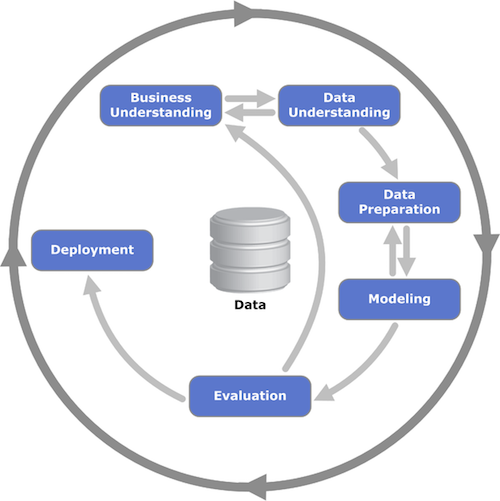

---
title       : Learning Analytics
subtitle    : Presentatie Politieacademie
author      : Witek ten Hove, MBA
job         : Docent HAN BKMER / Data Analist
framework   : CFA2016        # {io2012, html5slides, shower, dzslides, ...}
highlighter : highlight.js  # {highlight.js, prettify, highlight}
hitheme     : tomorrow      # 
widgets     : [angularjs]            # {mathjax, quiz, bootstrap}
mode        : selfcontained # {standalone, draft}
knit        : slidify::knit2slides

--- .class #slide1

<h3>Data-analyse:</h3>
 

--- .class #slide2

<h3>Business understanding:</h3>

<iframe src="diagram1.html" width=100% height=100% allowtransparency="true"> </iframe>

--- .class #slide3

 <h1>Digitization</h1>

<h3>"What's the price of not knowing?"</h3>

 
<h4><b><i>John E. Kelly</i></b></h4>
<h4><i>Senior Vice President, Cognitive Solutions and IBM Research</i></h4>
  

--- .class #slide4

 <h1>Network Centric</h1>

<h3>"Transparency along the entire value stream in real-time"</h3>

 
<b><i>Quote taken from Bosch <a href="http://ec2-52-30-100-113.eu-west-1.compute.amazonaws.com/pluginfile.php/163/mod_lesson/page_contents/16/bosch.mp4">company video</a></i></b>
  

--- .class #slide5

 <h1>Didactisch concept</h1>
   

<iframe src="diagram.html"></iframe>

